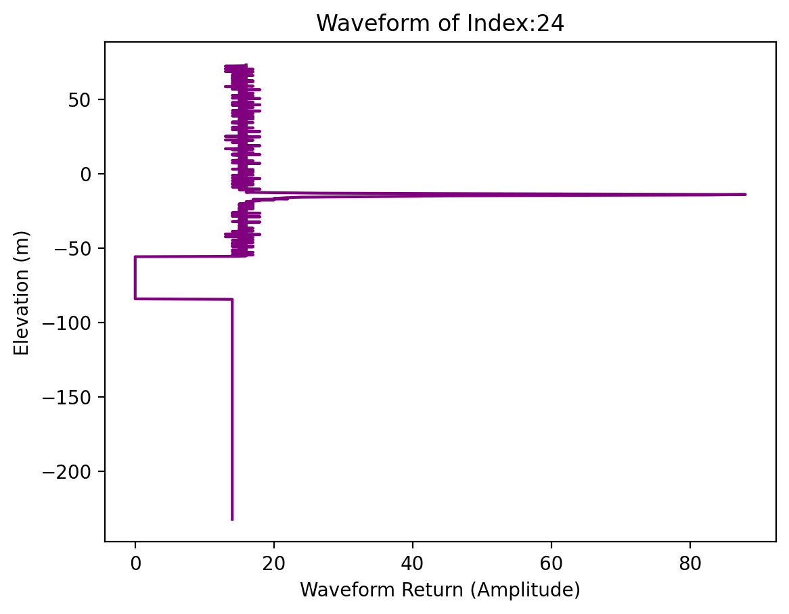
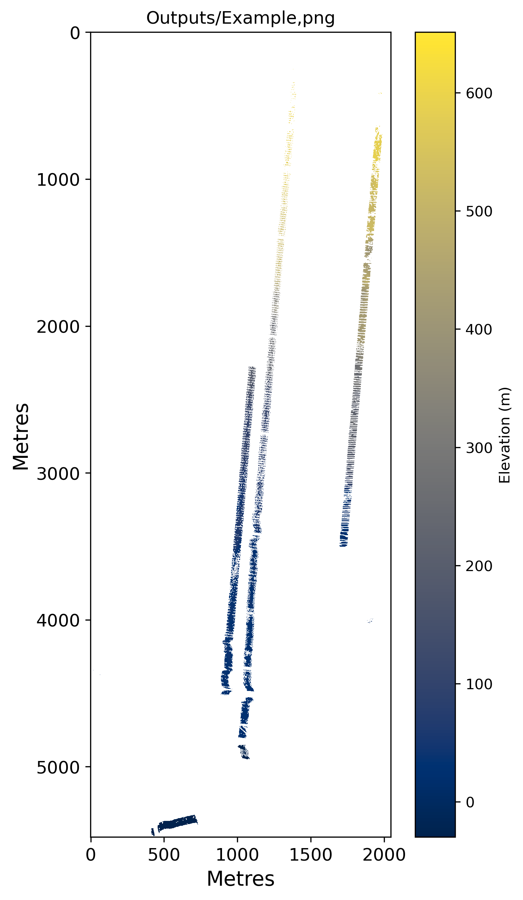

## OOSA Final Assignment.

This library uses the raw Land, Vegetetaion and Ice Sensor (LVIS) data ([link](https://lvis.gsfc.nasa.gov/Data/Data_Download.html)) via _geosnetdata_, from Operation IceBridge to process and create raster DEMs from the 20th October 2009 and 17th October 2015.

**The repository is organised as follows:**

```
│── source/
│   │── lvisClass.py
│   │── lvisTiff.py
│   │── processLVIS.py
│   │── handleTiff.py
│── static/
│   │── task1_image.png
│   │── task2_image.png
│   │── 
│── Outputs/
│── task1.py
│── task2.py
│── task3attempt.py
│── task3bound.py
│── task3folderloop.py
│── task4.py
│── task5.py?
│── README.md
```
-	**Source:** Contains multiple files that are required to complete the specified tasks.
-	**Data2009:** A folder where the 2009 tiled rasters are stored when being processed.
-	**Data 2015:** A folder where the 2015 tiled rasters are stored when being processed.
-	**Outputs:** A folder where the final outputs are stored. This includes the waveform.png, single file DEM and full DEMs for both 2009 and 2015.
-	**TasksX** run each specifed task.
-	README file.
-----
### Libraries Required: 
The follwowing libraries are required for the scripts to run:
-	NumPy: For array operations such as data cleaning, transformation and aggregation.
-	h5py: to read and write HDF5 files. 
-	Matplotlib: For formatting and displaying the plots.
-	os: For file system operations.
-	rasterio (and rasterio.merge): For reading, writing and handling rasters.
-	osgeo (gdal and osr): For handling geotiff data and managing projections.
-	pyproj (Transformer): For coordinate system transformations.
-	Glob (Glob): For iterating through multiple files in a folder.
-	argparse: For handling command line options.
-	Tracemalloc: For tracking memory during script use.

Incase any of the libraries need to be installed:
```
    pip install [library]
```
-----------
### Running The Code:
**Install the github repo**
To clone the repository:
```
    git clone git@github.com:s2762697/OOSA_code.git
```
**Task 1:**

To run:
```
    python task1.py -f /geos/netdata/oosa/assignment/lvis/2009/ILVIS1B_AQ2009_1020_R1408_049700.h5 --i 24
```  
1. This script reads the specifed file and creates a plot of _one waves'_ full LiDAR return data (amplitude). 
2. If chosen index contains data, this saves the plot to the Output folder.

This will display the following output:



**Task 2:**

To run:
```
    python task2.py -f /geos/netdata/oosa/assignment/lvis/2009/ILVIS1B_AQ2009_1020_R1408_058456.h5 --res 30 --o 'Example.tif'

```
1. This script creates subset tiles and loops through (for one file) and converts the tiles into rasters of a chosen resolution.
2. These rasters are stored in a folder (Data2009) and then merged into one TIF file.

This will display the following output:



**Task 3:**

task3folderloop = *Don't run* this file as it is massive
task3bound = The bounds are working for a chosen .h5 file
task3attempt = Attempt to combine - runs but doesnt produce an appropriate output.

To run:
```
    python task3boundspy -f /geos/netdata/oosa/assignment/lvis/2009/ILVIS1B_AQ2009_1020_R1408_058456.h5 --res 30 --o 'Example.tif'

```

**Task 4:**

Pseudo code is provided for this task and would use a function called fill gaps from rasterio.
The script currently has bugs and cannot identify the areas of no data.

**Task 5:**


----------------
References:!?

